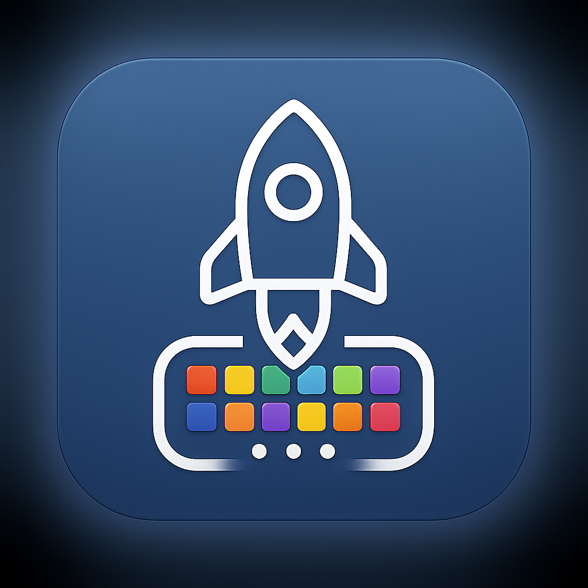

# Return Launchpad

<div align="center">
  
  
  **Bring back the full-screen app launcher to macOS Tahoe**
  
  [](https://www.apple.com/macos/)
  [](https://swift.org/)
  [](LICENSE)
  [](https://github.com/shorins/return-launchpad/tree/main/release-versions)

  [Download Latest Release](https://github.com/shorins/return-launchpad/tree/main/release-versions) • [Report Bug](https://github.com/shorins/return-launchpad/issues) • [Request Feature](https://github.com/shorins/return-launchpad/issues)
</div>

## Star History

[](https://www.star-history.com/#shorins/return-launchpad&Date)

## 🎯 Overview

Apple removed the traditional Launchpad from macOS Tahoe, disrupting user workflows that relied on the full-screen grid interface for launching applications. **Return Launchpad** brings back this beloved feature with modern enhancements, providing a familiar yet improved app launcher experience.

### Why Return Launchpad?

- **🔄 Restores Familiar Workflow**: Get back the full-screen app grid you're used to
- **🚀 Enhanced Performance**: Built with modern SwiftUI for smooth, responsive interactions
- **🔍 Smart Search**: Real-time filtering to quickly find any application
- **⌨️ Keyboard Navigation**: Arrow keys for efficient browsing
- **🎨 Native Integration**: Uses macOS blur effects and system animations
- **🔒 Privacy-First**: Completely offline, no data collection

## 📝 Release Notes

For detailed information about the latest updates and improvements, check out our [Release Notes](UPDATES.md). 

You can download the latest version and previous releases from our [release-versions folder](https://github.com/shorins/return-launchpad/tree/main/release-versions).

**Latest Release (v2) Highlights:**
- Added ESC key support to close the application
- Added arrow key navigation and Enter support in search
- Added smooth icon movement animation during search
- Added page flipping animation
- Improved page switching performance
- Optimized search: filtered list is cached and recalculated only on changes
- Minor optimizations and bug fixes
- Fixed control returning to arrow navigation after canceling search
- Added universal x86 build with Intel macOS support

## ✨ Features

### Core Functionality
- **Full-Screen Grid Layout**: Displays all installed applications in an organized, responsive grid
- **Real-Time Search**: Instantly filter applications as you type
- **Smart Pagination**: Automatically organizes apps across multiple pages
- **One-Click Launch**: Click any app icon to launch and automatically close the launcher
- **Keyboard Navigation**: Use left/right arrow keys to navigate between pages
- **Background Dismiss**: Click anywhere outside the grid or press Escape to close

### Visual & UX Enhancements
- **Native macOS Blur Effects**: Seamless integration with system visual style
- **Smooth Animations**: Fluid transitions and hover effects
- **Responsive Design**: Adapts to different screen sizes and resolutions
- **Floating Overlay**: Appears above all other applications
- **Custom App Ordering**: Drag and drop to rearrange apps (persistent across sessions)

### Technical Features
- **Automatic App Discovery**: Scans `/Applications` and `~/Applications` directories
- **Persistent Preferences**: Remembers your custom app arrangements
- **Performance Optimized**: Lazy loading for smooth performance with hundreds of apps
- **Memory Efficient**: Lightweight footprint with minimal system resource usage

## 🚀 Installation

### Download from Releases (Recommended)

1. Go to the [Releases page](https://github.com/shorins/return-launchpad/tree/main/release-versions)
2. Download the latest `Return-Launchpad-v*.dmg` file
3. Open the DMG and drag Return Launchpad to your Applications folder
4. **Important**: Right-click the app and select "Open" the first time to bypass Gatekeeper
5. Grant necessary permissions when prompted

### Build from Source

#### Prerequisites
- macOS 15.5 (Sequoia) or later
- Xcode 16.4 or later
- Apple Developer account (for code signing)

#### Steps

1. **Clone the repository**:
   ```bash
   git clone https://github.com/shorins/return-launchpad.git
   cd return-launchpad
   ```

2. **Open in Xcode**:
   ```bash
   open "Return Launchpad.xcodeproj"
   ```

3. **Configure signing**:
   - Select the project in Xcode navigator
   - Choose your development team in "Signing & Capabilities"
   - Ensure "Automatically manage signing" is enabled

4. **Build and run**:
   - Press `⌘R` to build and run
   - Or use: `⌘B` to build, then run the app from Products

#### Command Line Build

```bash
# Build the project
xcodebuild -project "Return Launchpad.xcodeproj" -scheme "Return Launchpad" -destination 'platform=macOS' build

# Create archive for distribution
xcodebuild -project "Return Launchpad.xcodeproj" -scheme "Return Launchpad" -destination 'platform=macOS' archive -archivePath "Return Launchpad.xcarchive"
```

## 📖 Usage

### Getting Started

1. **Launch the app** from Applications folder or Spotlight
2. **Grant permissions** if prompted (for accessing application directories)
3. The launcher will appear as a full-screen overlay with all your apps

### Basic Operations

- **Search**: Start typing to filter applications in real-time
- **Navigate**: Use left/right arrow keys to browse pages
- **Launch App**: Click any app icon to launch it (launcher closes automatically)
- **Close Launcher**: Click outside the grid area or press Escape
- **Rearrange Apps**: Drag and drop app icons to customize their order

### Keyboard Shortcuts

| Shortcut | Action |
|----------|--------|
| `Type` | Search/filter applications |
| `← →` | Navigate between pages |
| `Escape` | Close launcher |
| `Enter` | Launch selected/first app in search results |

### Tips for Best Experience

- **Organize by usage**: Drag frequently used apps to the first page
- **Use search for speed**: Type a few letters instead of browsing
- **Multiple monitors**: The launcher appears on the active screen
- **Performance**: The app is optimized for smooth performance with 200+ applications

## 🏗️ Architecture

Return Launchpad follows a clean **MVVM (Model-View-ViewModel)** architecture using SwiftUI's reactive programming model.

### Architecture Overview

```
graph TB
    A[Return_LaunchpadApp] --> B[AppManager]
    B --> C[AppInfo]
    A --> D[ContentView]
    D --> B
    D --> C
    D --> E[VisualEffectBlur]
    E --> F[NSVisualEffectView]
    B --> G[AppScanner]
    G --> H[FileManager]
    G --> I[Bundle]
    D --> J[NSWorkspace]
    B --> K[AppOrderManager]
    K --> L[UserDefaults]
    style A fill:#4a90e2,stroke:#333
    style B fill:#7ed321,stroke:#333
    style D fill:#f5a623,stroke:#333
```

### Core Components

#### **AppManager** (ViewModel)
- Central state coordinator using `ObservableObject`
- Manages application list, search queries, and pagination
- Coordinates with `AppOrderManager` for persistent custom ordering
- Publishes state changes to trigger UI updates

#### **ContentView** (View)
- Main UI implementation using SwiftUI
- Responsive grid layout with `LazyVGrid`
- Search interface and pagination controls
- Handles user interactions and keyboard events

#### **AppInfo** (Model)
- Data structure representing individual applications
- Contains app metadata: name, icon, URL, bundle identifier
- Conforms to `Identifiable`, `Hashable`, and `Codable`

#### **AppScanner** (Service)
- Discovers installed applications in standard directories
- Extracts app metadata from bundle information
- Handles icon extraction with fallback strategies

#### **AppOrderManager** (Persistence)
- Manages custom app ordering and arrangement
- Persists user preferences using UserDefaults
- Handles drag-and-drop reordering logic

### Key Design Patterns

- **Observer Pattern**: SwiftUI's `@Published` and `@ObservableObject`
- **Dependency Injection**: Environment objects for state sharing
- **Repository Pattern**: `AppScanner` encapsulates data access logic
- **Command Pattern**: User actions trigger state changes through AppManager

### Technology Stack

- **UI Framework**: SwiftUI (declarative UI)
- **Language**: Swift 5.9+
- **System Integration**: AppKit (NSVisualEffectView, NSWorkspace)
- **Build System**: Xcode/xcodebuild
- **Persistence**: UserDefaults and Property Lists
- **Package Management**: Native Xcode (no external dependencies)

## 🤝 Contributing

We welcome contributions from the community! Whether you're fixing bugs, adding features, improving documentation, or testing on different systems, your help is appreciated.

### Quick Start for Contributors

1. **Fork** the repository
2. **Create a feature branch**: `git checkout -b feature/awesome-feature`
3. **Make your changes** following our coding guidelines
4. **Test thoroughly** on your development machine
5. **Submit a pull request** with a clear description

### What We Need Help With

- 🐛 **Bug Reports**: Help us identify issues on different macOS versions
- ✨ **Feature Development**: Implement items from our roadmap
- 📖 **Documentation**: Improve guides, comments, and examples
- 🧪 **Testing**: Test on various hardware and system configurations
- 🌍 **Localization**: Help translate the app (future feature)
- 🎨 **Design**: UI/UX improvements and accessibility enhancements

### Development Guidelines

- Follow Swift API Design Guidelines
- Use meaningful names and add documentation for public APIs
- Keep functions focused and under 20 lines when possible
- Test on different screen sizes and app counts
- Ensure smooth performance and responsive UI

For detailed contribution guidelines, see [CONTRIBUTING.md](CONTRIBUTING.md).

## 🐛 Bug Reports & Feature Requests

We use GitHub Issues to track bugs and feature requests. Please help us maintain a high-quality project by following these guidelines:

### 🐛 Reporting Bugs

**Before submitting**, please:
1. Check if the issue already exists in [existing issues](https://github.com/shorins/return-launchpad/issues)
2. Try the latest release version
3. Test with minimal setup (few applications)

**Include in your bug report**:
- **Clear description** of the problem
- **Steps to reproduce** the issue
- **Expected vs. actual behavior**
- **Environment details**: macOS version, app version, hardware
- **Screenshots or videos** if relevant
- **Console logs** if the app crashes (check Console.app)

### ✨ Requesting Features

**Great feature requests include**:
- **Clear use case**: Why would this be useful?
- **Detailed description**: How should it work?
- **Implementation ideas**: Any thoughts on technical approach?
- **Mockups or examples**: Visual aids help a lot

### 📋 Current Roadmap

- [ ] **Escape key support** for closing launcher
- [ ] **Custom keyboard shortcuts** (e.g., Cmd+Space activation)
- [ ] **Multi-monitor optimization**
- [ ] **Accessibility improvements**
- [ ] **Themes and customization options**
- [ ] **Application categories/folders**
- [ ] **Recent/frequently used apps section**
- [ ] **Localization support**

## 🔒 Privacy

Return Launchpad is designed with privacy as a core principle:

### What We DON'T Do

- ❌ **No data collection**: We don't collect any personal information
- ❌ **No network requests**: The app works completely offline
- ❌ **No analytics**: No usage tracking or telemetry
- ❌ **No third-party services**: No external dependencies or services

### What We DO

- ✅ **Local-only operation**: All data stays on your Mac
- ✅ **Standard macOS permissions**: Only requests necessary file access
- ✅ **Transparent operation**: Open-source code for full transparency
- ✅ **Minimal footprint**: Only accesses application directories for scanning

### Permissions Required

- **File System Access**: To scan `/Applications` and `~/Applications` directories
- **Accessibility** (optional): For enhanced keyboard navigation features

All permissions are used solely for core functionality and never for data collection.

## 📄 License

Return Launchpad is released under the [MIT License](LICENSE).

```
MIT License

Copyright (c) 2025 Return Launchpad Contributors

Permission is hereby granted, free of charge, to any person obtaining a copy
of this software and associated documentation files (the "Software"), to deal
in the Software without restriction, including without limitation the rights
to use, copy, modify, merge, publish, distribute, sublicense, and/or sell
copies of the Software, and to permit persons to whom the Software is
furnished to do so, subject to the following conditions:

The above copyright notice and this permission notice shall be included in all
copies or substantial portions of the Software.

THE SOFTWARE IS PROVIDED "AS IS", WITHOUT WARRANTY OF ANY KIND, EXPRESS OR
IMPLIED, INCLUDING BUT NOT LIMITED TO THE WARRANTIES OF MERCHANTABILITY,
FITNESS FOR PURPOSE AND NONINFRINGEMENT. IN NO EVENT SHALL THE AUTHORS OR
COPYRIGHT HOLDERS BE LIABLE FOR ANY CLAIM, DAMAGES OR OTHER LIABILITY,
WHETHER IN AN ACTION OF CONTRACT, TORT OR OTHERWISE, ARISING FROM, OUT OF OR
IN CONNECTION WITH THE SOFTWARE OR THE USE OR OTHER DEALINGS IN THE SOFTWARE.
```

### What This Means

- ✅ **Use commercially**: Use Return Launchpad in commercial environments
- ✅ **Modify**: Create your own versions and modifications
- ✅ **Distribute**: Share the app or your modifications
- ✅ **Private use**: Use for personal projects
- ✅ **Patent use**: Use any patents in the project

**Requirements**: Include the license and copyright notice in any copies.

## 🙏 Acknowledgments

- **Apple**: For the inspiration from the original Launchpad
- **SwiftUI Community**: For excellent resources and examples
- **macOS Developer Community**: For testing and feedback
- **Contributors**: Everyone who has helped improve this project

## 📞 Support

- **Documentation**: Check this README and [CONTRIBUTING.md](CONTRIBUTING.md)
- **Issues**: [GitHub Issues](https://github.com/shorins/return-launchpad/issues) for bugs and features
- **Discussions**: [GitHub Discussions](https://github.com/shorins/return-launchpad/discussions) for questions
- **Email**: For sensitive issues, contact mighty.shorin@yandex.ru

---

<div align="center">
  <strong>Return Launchpad</strong> • Bringing back the full-screen app launcher to macOS
  <br><br>
  <a href="https://github.com/shorins/return-launchpad/stargazers">⭐ Star this project</a> • 
  <a href="https://github.com/shorins/return-launchpad/issues">🐛 Report Issues</a> • 
  <a href="https://github.com/shorins/return-launchpad/blob/main/CONTRIBUTING.md">🤝 Contribute</a>
</div>
