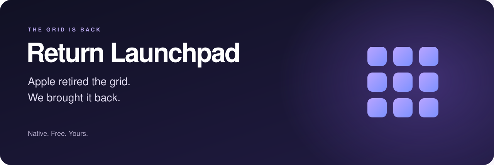
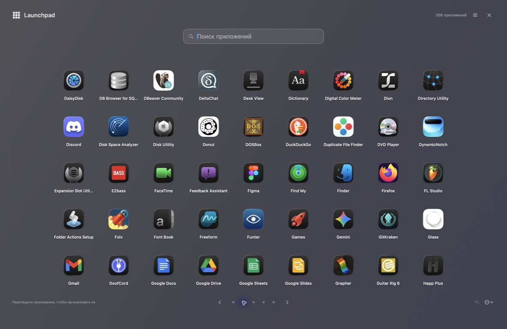
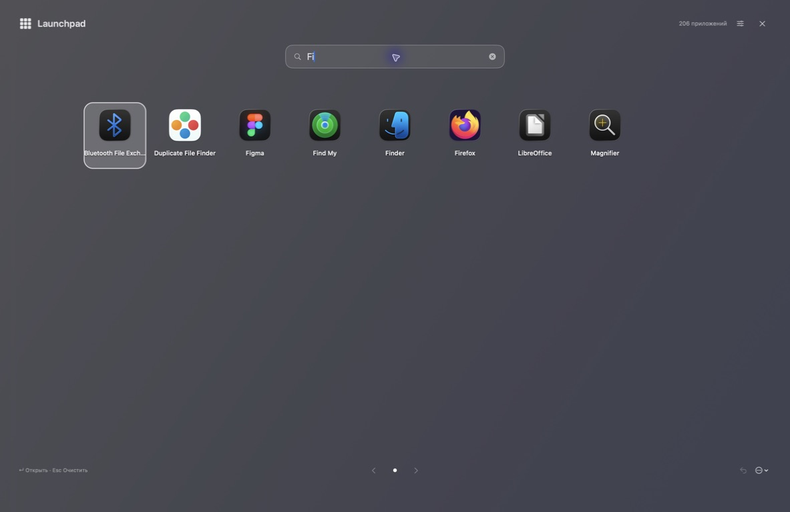
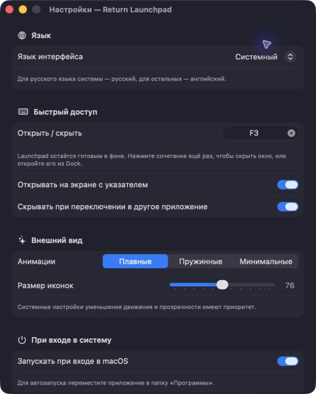

**Твои приложения. Твои папки. Твой Mac.**

[Скачать для Mac](https://github.com/shorins/return-launchpad/releases/latest) · [English](README.md) · [Сообщить об ошибке](https://github.com/shorins/return-launchpad/issues/new/choose)

## Apple убрала Launchpad. Мы вернули сетку.

Кому-то достаточно поиска. А кому-то нравится видеть приложения перед собой, складывать их в папки и помнить, где что лежит. Return Launchpad возвращает этот привычный способ пользоваться Mac — с плавными переходами и настройками под себя.

Без регистрации, подписки и аналитики. Бесплатно, с открытым исходным кодом.

## Всё нужное — на своих местах

- **Всегда под рукой.** Нажми **Control + Option + Пробел** или назначь своё сочетание. При желании включи запуск при входе.
- **Поиск без лишних действий.** Начни печатать, выбери результат стрелками и нажми Enter. Без запроса стрелки переключают страницы.
- **Системные приложения тоже здесь.** Лаунчер находит приложения и утилиты macOS. Дополнительные папки можно подключить в настройках.
- **Папки и порядок.** Перетаскивай, группируй, переименовывай. Раскладка сохраняется, а сами приложения на диске не перемещаются.
- **Плавное движение.** Перелистывание, раскрытие папок и перенос иконок. На выбор — плавные, пружинные или минимальные анимации.
- **Можно передумать.** ⌘Z отменяет изменение раскладки, ⇧⌘Z возвращает его.

Нативные **SwiftUI + AppKit**, одна сборка для **Apple Silicon и Intel**. Учитываются системные настройки уменьшения движения и прозрачности. В настройках можно выбрать **Системный / Русский / English**. По умолчанию язык системный: для русского — русский, для остальных — английский.

## Посмотри поближе

Это скриншоты работающего приложения. На снимке настроек показано пользовательское сочетание F3; по умолчанию используется Control + Option + Пробел, автозапуск выключен.

## Установка

1. Открой [последний релиз](https://github.com/shorins/return-launchpad/releases/latest) и скачай **DMG с пометкой universal**.
2. Открой образ и перетащи **Return Launchpad** в **«Программы»**.
3. Запусти приложение. **⌃⌥Пробел** открывает и скрывает лаунчер; **⌘,** открывает настройки.

**macOS 15.5 и новее · Apple Silicon и Intel · лицензия MIT**

> Текущие сборки подписаны локальной ad-hoc подписью и **не нотарифицированы Apple**. Если macOS блокирует первый запуск и ты доверяешь скачанному файлу, сначала попробуй открыть приложение, затем зайди в **Системные настройки → Конфиденциальность и безопасность → Всё равно открыть**. [Инструкция Apple](https://support.apple.com/en-us/102445). Отключать Gatekeeper целиком не нужно.

Рядом с DMG лежит контрольная сумма `.sha256`. Скачай оба файла в одну папку и проверь: `shasum -a 256 -c Return-Launchpad-3.7.0-universal.dmg.sha256`. Обновления устанавливаются вручную из Releases; перед заменой заверши старую версию приложения.

## Как пользоваться

| Что сделать | Как |
| --- | --- |
| Найти и открыть | Ввод названия → стрелки → Enter |
| Перелистнуть страницу | Стрелки при пустом поиске |
| Создать папку | Задержи иконку над центром другой и отпусти после подсветки |
| Перенести на другую страницу | Задержи иконку у левого или правого края |
| Зайти в папку при переносе | Задержи иконку над папкой |
| Вытащить из папки | Перетащи в подсвеченную зону возврата на главный экран |
| Вернуться или скрыть | Esc или клик в пустом месте; из папки сначала вернёшься к сетке |
| Отменить / повторить | ⌘Z / ⇧⌘Z |
| Настройки / завершить | ⌘, / ⌘Q |

Для личной `~/Applications` и других каталогов выбери **«Добавить папку приложений…»** в настройках. Разрешение на выбранную папку сохраняется. Полный доступ к диску не нужен.

## Маленькое приложение с открытым кодом

Иконки кэшируются, чтобы не ждать их при каждом открытии страницы. После скрытия лаунчер остаётся готовым в фоне, без значка в строке меню. Открыть его снова можно горячей клавишей или из Dock.

Идеи, исправления и сообщения об ошибках приветствуются.

Если тоже скучал по Launchpad — поставь звезду. Пусть сетка живёт.

[MIT](LICENSE). Независимый проект сообщества, не связан с Apple и не одобрен ею. Иконки приложений на скриншотах принадлежат соответствующим правообладателям.
