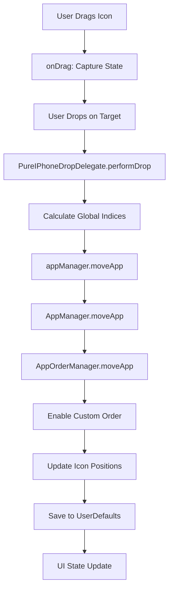

# Icon Order Persistence System in Return Launchpad

## Overview

This document provides a comprehensive analysis of how Return Launchpad implements persistent icon ordering across application restarts. The system ensures that custom icon arrangements survive app termination (including Cmd+Q) and are restored on subsequent launches.

## Architecture Components

### 1. Core Classes and Responsibilities

#### **AppOrderManager** (Primary Persistence Engine)
- **Location**: `/Return Launchpad/AppOrderManager.swift`
- **Role**: Manages all persistence operations for icon ordering
- **Key Features**:
  - Multi-layered UserDefaults strategy (App Group + Standard fallback)
  - User-specific data storage with username-prefixed keys
  - Automatic data validation and migration
  - Real-time persistence with multiple save triggers

#### **AppManager** (UI State Coordinator) 
- **Location**: `/Return Launchpad/AppManager.swift`
- **Role**: Coordinates between UI and persistence layer
- **Key Features**:
  - Bridges drag & drop operations to persistence
  - Maintains UI state synchronization
  - Handles app loading and sorting logic

#### **PersistenceLogger** (Debug & Monitoring)
- **Location**: `/Return Launchpad/PersistenceLogger.swift`
- **Role**: Comprehensive logging for debugging persistence operations
- **Key Features**:
  - System-wide logging with Console.app integration
  - UserDefaults operation tracking
  - Drag & drop operation monitoring

## Data Storage Strategy

### Multi-Layered Persistence Architecture

The system implements a sophisticated multi-layered approach for maximum reliability:

```swift
private struct PersistenceStrategy {
    let primary: UserDefaults      // App Group container
    let fallback: UserDefaults     // Standard UserDefaults
    
    // Writes to both locations for redundancy
    func set(_ value: Any?, forKey key: String) {
        primary.set(value, forKey: key)
        primary.synchronize()
        
        if primary !== fallback {
            fallback.set(value, forKey: key)
            fallback.synchronize()
        }
    }
}
```

#### **Primary Storage: App Group UserDefaults**
- **Container**: `group.shorins.return-launchpad`
- **Configuration**: Defined in `Return_Launchpad.entitlements`
- **Benefits**: 
  - Survives app relocation and reinstallation
  - Shared container access across app versions
  - Robust persistence for sandboxed environments

#### **Fallback Storage: Standard UserDefaults**
- **Container**: `UserDefaults.standard`
- **Purpose**: Backup storage when App Group is unavailable
- **Migration**: Automatic data migration between storage types

### User-Specific Data Keys

The system creates unique storage keys for each macOS user:

```swift
private let currentUser = NSUserName()
private var customOrderEnabledKey: String { "\(currentUser)_isCustomOrderEnabled" }
private var userAppOrderKey: String { "\(currentUser)_userAppOrder" }
```

**Example Keys**:
- `sergeyshorin_isCustomOrderEnabled` → Boolean flag
- `sergeyshorin_userAppOrder` → JSON array of bundle identifiers

## Data Structure and Format

### Persistence Data Types

#### **1. Custom Order Flag**
```swift
@Published var isCustomOrderEnabled: Bool = false
```
- **Type**: Boolean
- **Purpose**: Switches between alphabetical (false) and custom (true) ordering
- **Auto-Save**: Triggers persistence on every change via `didSet`

#### **2. Icon Order Array**
```swift
@Published private var userOrderJSON: String = ""
private var userDefinedOrder: [String] // Array of bundle identifiers
```
- **Storage Format**: JSON string in UserDefaults
- **Runtime Format**: Array of bundle identifiers (e.g., `["com.apple.Safari", "com.microsoft.VSCode"]`)
- **Encoding**: UTF-8 JSON with JSONEncoder/JSONDecoder

### Data Validation and Integrity

The system includes comprehensive validation:

```swift
func validateData(enabledKey: String, orderKey: String) -> (isValid: Bool, issues: [String]) {
    // Validates JSON structure
    // Checks data corruption
    // Reports validation issues
    // Auto-repairs corrupted data
}
```

## Persistence Triggers and Save Points

### Automatic Save Operations

#### **1. Real-Time Property Changes**
```swift
@Published var isCustomOrderEnabled: Bool = false {
    didSet {
        persistenceStrategy.set(isCustomOrderEnabled, forKey: customOrderEnabledKey)
    }
}
```

#### **2. Drag & Drop Operations**
```swift
func moveApp(from sourceIndex: Int, to destinationIndex: Int, in apps: [AppInfo]) -> [AppInfo] {
    // Automatically enables custom order
    if !isCustomOrderEnabled {
        enableCustomOrder()
    }
    
    // Updates icon positions
    userDefinedOrder = reorderedApps.map { $0.bundleIdentifier }
    
    // Force saves after drag & drop
    forceSave()
}
```

#### **3. Application Lifecycle Events**
```swift
// App termination handler
@objc private func appWillTerminate() {
    forceSave()
}

// Periodic backup saves (every 30 seconds)
Timer.scheduledTimer(withTimeInterval: 30.0, repeats: true) { _ in
    self.forceSave()
}

// Object destruction safety
deinit {
    forceSave()
}
```

### Force Save Implementation

```swift
func forceSave() {
    persistenceStrategy.set(isCustomOrderEnabled, forKey: customOrderEnabledKey)
    persistenceStrategy.set(userOrderJSON, forKey: userAppOrderKey)
    // Redundant writes to both primary and fallback storage
}
```

## Loading and Restoration Process

### Application Startup Sequence

#### **1. AppOrderManager Initialization**
```swift
init() {
    // Initialize persistence strategy
    self.persistenceStrategy = PersistenceStrategy()
    
    // Migrate data between storage types if needed
    persistenceStrategy.migrateDataIfNeeded(...)
    
    // Validate data integrity
    let validation = persistenceStrategy.validateData(...)
    
    // Load saved values WITHOUT triggering didSet
    let savedOrderEnabled = persistenceStrategy.bool(forKey: customOrderEnabledKey)
    let savedOrderJSON = persistenceStrategy.string(forKey: userAppOrderKey) ?? ""
    
    // Set values directly to avoid save-during-load
    self._isCustomOrderEnabled = Published(initialValue: savedOrderEnabled)
    self._userOrderJSON = Published(initialValue: savedOrderJSON)
}
```

#### **2. App Loading and Sorting**
```swift
private func loadApps() {
    // Scan applications from system
    let scannedApps = appScanner.scanApps()
    
    // Apply saved ordering
    let sortedApps = orderManager.sortApps(scannedApps)
    
    // Update UI
    DispatchQueue.main.async {
        self.apps = sortedApps
        self.hasNewApps = self.orderManager.hasNewApps(in: scannedApps)
    }
}
```

### Sorting Algorithm

#### **Custom Order Mode** (`isCustomOrderEnabled = true`)
```swift
private func sortByUserOrder(_ apps: [AppInfo]) -> [AppInfo] {
    var sortedApps: [AppInfo] = []
    var remainingApps = apps
    
    // First: Add apps in saved custom order
    for bundleId in userDefinedOrder {
        if let index = remainingApps.firstIndex(where: { $0.bundleIdentifier == bundleId }) {
            sortedApps.append(remainingApps.remove(at: index))
        }
    }
    
    // Second: Add new apps (not in saved order) alphabetically
    let newApps = remainingApps.sorted { $0.name.lowercased() < $1.name.lowercased() }
    sortedApps.append(contentsOf: newApps)
    
    // Update saved order to include new apps
    updateUserOrderWithNewApps(sortedApps)
    
    return sortedApps
}
```

#### **Alphabetical Mode** (`isCustomOrderEnabled = false`)
```swift
// Simple alphabetical sorting by app name
return apps.sorted { $0.name.lowercased() < $1.name.lowercased() }
```

## Drag & Drop Integration

### ContentView: The Critical UI-Persistence Bridge

The ContentView is the crucial bridge between user interactions and the persistence system. Previous versions had issues where drag & drop operations weren't properly calling the persistence methods, breaking the entire save system.

### Critical UI Components

#### **1. Pure iPhone-Style Drop Delegates**

The current implementation uses `PureIPhoneDropDelegate` which ensures every drop operation calls the persistence system:

```swift
struct PureIPhoneDropDelegate: SwiftUI.DropDelegate {
    func performDrop(info: DropInfo) -> Bool {
        // Critical step: Calculate global indices for persistence
        let globalOriginalIndex = currentPage * itemsPerPage + originalIndex
        let globalTargetIndex = currentPage * itemsPerPage + targetIndex
        
        // THE CRITICAL CALL: This triggers the entire persistence chain
        if globalOriginalIndex < appManager.apps.count && globalTargetIndex < appManager.apps.count {
            print("✅ EXECUTING iPhone appManager.moveApp(\(globalOriginalIndex) → \(globalTargetIndex))")
            appManager.moveApp(from: globalOriginalIndex, to: globalTargetIndex)
        }
    }
}
```

**Key Points**:
- **Global Index Mapping**: Converts page-local indices to global app array indices
- **Boundary Checking**: Validates indices before calling persistence
- **Direct Method Call**: `appManager.moveApp()` triggers the entire persistence chain

#### **2. UI State Indicators**

The ContentView displays persistence state through UI elements:

```swift
// Custom order indicator
if appManager.isCustomOrderEnabled {
    HStack(spacing: 4) {
        Image(systemName: "arrow.up.arrow.down")
        Text("Пользовательский порядок")
    }
    .background(Color.blue.opacity(0.2))
}

// Reset button that calls persistence
if appManager.isCustomOrderEnabled {
    Button("Алфавит") {
        withAnimation(.easeInOut(duration: 0.3)) {
            appManager.resetToAlphabeticalOrder()  // Calls persistence reset
        }
    }
}
```

#### **3. Drag Interaction Setup**

Each icon is configured with both drag source and drop target:

```swift
appIconView(app: app)
    .onDrag {
        // Capture drag state
        draggedItem = app
        draggedItemOriginalIndex = appIndex
        stablePageApps = pageApps
        isInDragMode = true
        return NSItemProvider(object: app.bundleIdentifier as NSString)
    }
    .onDrop(of: [.text], delegate: PureIPhoneDropDelegate(
        targetIndex: appIndex,
        app: app,
        displayApps: displayApps,
        appManager: appManager,  // Critical: Provides access to persistence
        // ... other parameters
    ))
```

### UI-Persistence Call Chain

The complete flow from user action to data persistence:



### Previous Issues and Solutions

#### **Problem: Broken Persistence Chain**
In earlier versions, drag & drop operations weren't properly calling the persistence methods, causing:
- Icons would move visually but not save
- Custom order wouldn't be enabled automatically
- Data wouldn't persist across app restarts

#### **Solution: Direct Method Binding**
The current implementation ensures every drop calls persistence:

```swift
// OLD: Complex insertion zones with potential call failures
iPhoneStyleInsertionZone(...) // Could fail to call persistence

// NEW: Direct icon drops with guaranteed persistence calls
.onDrop(of: [.text], delegate: PureIPhoneDropDelegate(
    appManager: appManager  // Direct reference ensures calls work
))
```

#### **Critical Fix: Index Mapping**
The pagination system requires careful index conversion:

```swift
// Convert page-local indices to global indices
let globalOriginalIndex = currentPage * itemsPerPage + originalIndex
let globalTargetIndex = currentPage * itemsPerPage + targetIndex

// This ensures persistence operates on correct global positions
appManager.moveApp(from: globalOriginalIndex, to: globalTargetIndex)
```

### Debugging ContentView Issues

#### **Log Verification**
The system logs every step of the UI-persistence chain:

```swift
// Drag start
print("🎯 DRAG STARTED: \(app.name) at index \(appIndex)")

// Drop calculation
print("🌍 Global move: \(globalOriginalIndex) → \(globalTargetIndex)")

// Persistence call
print("✅ EXECUTING iPhone appManager.moveApp(\(globalOriginalIndex) → \(globalTargetIndex))")
```

#### **Common Failure Points**
1. **Index Calculation Errors**: Wrong global index mapping
2. **Boundary Violations**: Trying to access invalid array indices
3. **Missing AppManager Reference**: Drop delegate can't call persistence
4. **State Desynchronization**: UI state doesn't match persistence state

#### **Validation Checks**
The system includes safety checks:

```swift
// Ensure valid drop target
guard let draggedItem = draggedItem,
      let originalIndex = draggedItemOriginalIndex,
      draggedItem.id != app.id else {
    print("❌ Invalid drop - same app or missing data")
    return false
}

// Ensure valid array indices
if globalOriginalIndex < appManager.apps.count && globalTargetIndex < appManager.apps.count {
    // Safe to proceed with persistence
    appManager.moveApp(from: globalOriginalIndex, to: globalTargetIndex)
} else {
    print("❌ Invalid global indices")
}
```

### Automatic Custom Order Activation

Following the project specification for "Custom Order Activation":

```swift
func moveApp(from sourceIndex: Int, to destinationIndex: Int, in apps: [AppInfo]) -> [AppInfo] {
    // AUTOMATIC ACTIVATION: Moving apps enables custom ordering
    if !isCustomOrderEnabled {
        enableCustomOrder()  // Sets isCustomOrderEnabled = true
    }
    
    // Perform the move operation
    var reorderedApps = apps
    let movedApp = reorderedApps.remove(at: sourceIndex)
    reorderedApps.insert(movedApp, at: destinationIndex)
    
    // PERSISTENT STORAGE: Save both flag and new order
    userDefinedOrder = reorderedApps.map { $0.bundleIdentifier }
    forceSave()  // Immediate persistence
    
    return reorderedApps
}
```

### Global Index Mapping

The system handles pagination by mapping local UI indices to global data indices:

```swift
// In PureIPhoneDropDelegate
let globalOriginalIndex = currentPage * itemsPerPage + originalIndex
let globalTargetIndex = currentPage * itemsPerPage + targetIndex

// Call the global move operation
appManager.moveApp(from: globalOriginalIndex, to: globalTargetIndex)
```

## Error Handling and Recovery

### Data Validation and Corruption Recovery

```swift
// Automatic validation on startup
let validation = persistenceStrategy.validateData(enabledKey: customOrderEnabledKey, orderKey: userAppOrderKey)
if !validation.isValid {
    // Clear corrupted data and reset to safe defaults
    persistenceStrategy.set(false, forKey: customOrderEnabledKey)
    persistenceStrategy.set("", forKey: userAppOrderKey)
}
```

### Migration Between Storage Types

```swift
func migrateDataIfNeeded(enabledKey: String, orderKey: String) {
    if primary !== fallback {
        // Migrate isCustomOrderEnabled flag
        if primary.object(forKey: enabledKey) == nil && fallback.object(forKey: enabledKey) != nil {
            let migratedEnabled = fallback.bool(forKey: enabledKey)
            primary.set(migratedEnabled, forKey: enabledKey)
        }
        
        // Migrate user app order
        if primary.string(forKey: orderKey) == nil, let migratedOrder = fallback.string(forKey: orderKey) {
            primary.set(migratedOrder, forKey: orderKey)
        }
        
        primary.synchronize()
    }
}
```

## Debugging and Monitoring

### Comprehensive Logging System

The `PersistenceLogger` provides detailed debugging capabilities:

#### **System Information Logging**
```swift
private func logSystemInfo() {
    log(.info, "User: \(NSUserName())")
    log(.info, "App Bundle ID: \(Bundle.main.bundleIdentifier ?? "unknown")")
    log(.info, "App Group: \(appGroupDefaults != nil ? "Available" : "NOT AVAILABLE")")
}
```

#### **Operation Tracking**
```swift
func logUserDefaultsOperation(_ operation: String, key: String, value: Any?, storage: String)
func logDragDrop(_ operation: String, fromIndex: Int?, toIndex: Int?, appName: String?)
func logAppLifecycle(_ event: String)
```

#### **Console Integration**
All logs are visible in:
- **Xcode Console**: During development
- **macOS Console.app**: For production debugging with filter `[RLPAD-DEBUG]`

### Debug Commands

To monitor persistence in real-time:
```bash
# Run app with full logging
"/Applications/Return Launchpad Pure iPhone.app/Contents/MacOS/Return Launchpad" 2>&1

# Monitor Console.app with filter
# Filter: process:Return Launchpad AND message:RLPAD-DEBUG
```

### ContentView Architecture Evolution

#### **The Problem with Previous Implementations**

Earlier versions of ContentView had architectural issues that prevented proper persistence:

**1. Dual Pattern Confusion**
```swift
// PROBLEMATIC: Two competing drop systems
HStack(spacing: 0) {
    iPhoneStyleInsertionZone(...)  // Blue line drop zones
    appIconView(app: app)          // Icon visual
    iPhoneStyleInsertionZone(...)  // More blue zones
}
```

**Issues**:
- Required precise targeting of small blue line areas
- Visual iPhone-style flow but functional dependency on insertion zones
- Failed drops when users missed the tiny drop zones
- Complex state management with multiple delegates

**2. Index Mapping Failures**
```swift
// PROBLEMATIC: Mixed array references
ForEach(pageApps) { app in  // Page subset
    .onDrop(delegate: DropDelegate(
        apps: $appManager.apps  // Full global array
    ))
}
```

**Issues**:
- `pageApps` vs `appManager.apps` index mismatches
- "Same app, no move needed" errors
- Persistence calls with wrong indices

#### **The Current Solution: Pure iPhone Architecture**

**1. Direct Icon Drop Targets**
```swift
// SOLUTION: Each icon is a complete drop target
appIconView(app: app)
    .onDrag { /* capture state */ }
    .onDrop(of: [.text], delegate: PureIPhoneDropDelegate(
        targetIndex: appIndex,
        app: app,
        appManager: appManager  // Direct persistence access
    ))
```

**Benefits**:
- Large drop zones covering entire icon areas
- No dependency on small insertion lines
- Direct method calls to persistence system
- Simplified state management

**2. Consistent Index Management**
```swift
// SOLUTION: Consistent array usage throughout
let displayApps = isInDragMode ? stablePageApps : pageApps

ForEach(displayApps) { app in  // Always same array
    .onDrop(delegate: PureIPhoneDropDelegate(
        displayApps: displayApps  // Matching array reference
    ))
}
```

**Benefits**:
- No array reference mismatches
- Proper index calculations
- Reliable persistence calls

#### **Critical Persistence Integration Points**

**1. AppManager Reference Passing**
```swift
// CRITICAL: appManager must be passed to drop delegate
.onDrop(of: [.text], delegate: PureIPhoneDropDelegate(
    appManager: appManager,  // THIS IS ESSENTIAL
    // ... other parameters
))
```

**2. Global Index Calculation**
```swift
// CRITICAL: Convert page indices to global indices
let globalOriginalIndex = currentPage * itemsPerPage + originalIndex
let globalTargetIndex = currentPage * itemsPerPage + targetIndex

// CRITICAL: Call with global indices
appManager.moveApp(from: globalOriginalIndex, to: globalTargetIndex)
```

**3. State Synchronization**
```swift
// CRITICAL: UI must reflect persistence state
@EnvironmentObject var appManager: AppManager

// Display custom order indicator
if appManager.isCustomOrderEnabled {
    // Show "Пользовательский порядок" indicator
}
```

### Testing ContentView Integration

#### **Verification Steps**
1. **Drag & Drop Test**: Every icon position should accept drops
2. **Persistence Test**: Each drop should trigger logging and save data
3. **Index Test**: Page navigation shouldn't break persistence
4. **State Test**: UI indicators should match persistence state

#### **Debug Logging Verification**
Successful ContentView integration produces these logs:
```
🎯 DRAG STARTED: AppName at index 2
🎯 iPhone DROP ENTERED: TargetApp at position 5
📍 iPhone PURE DROP on TargetApp at position 5
🔄 iPhone Moving AppName from 2 to position 5
🌍 Global move: 14 → 17
✅ EXECUTING iPhone appManager.moveApp(14 → 17)
```

#### **Failure Pattern Recognition**
```
❌ Invalid drop - same app or missing data
❌ Invalid global indices
🚫 Same app, no move needed
```

These errors indicate ContentView integration problems.

## Testing and Validation

### Manual Testing Procedure

1. **Basic Persistence Test**:
   - Launch app
   - Drag icons to new positions
   - Quit with Cmd+Q
   - Relaunch → Verify custom order restored

2. **Multi-User Test**:
   - Create different arrangements for different macOS users
   - Switch users → Verify user-specific persistence

3. **Storage Migration Test**:
   - Install app without App Group entitlements
   - Create custom order (saved to Standard UserDefaults)
   - Update app with App Group entitlements  
   - Verify automatic migration to App Group storage

4. **Corruption Recovery Test**:
   - Manually corrupt UserDefaults JSON
   - Restart app → Verify automatic recovery to safe defaults

### Automated Validation

The system includes built-in validation:
```swift
func verifyInitialization() -> (customOrderEnabled: Bool, savedItemsCount: Int) {
    // Returns current state for verification
    // Logs detailed initialization status
    // Confirms proper data loading
}
```

## Performance Considerations

### Optimization Strategies

1. **Lazy Loading**: Apps are scanned only when needed
2. **Efficient Sorting**: O(n) custom order application vs O(n log n) alphabetical
3. **Minimal Saves**: Only save when actual changes occur
4. **Background Persistence**: UI updates happen immediately, persistence is async when possible

### Memory Management

- **Weak References**: Prevents retain cycles in observers
- **Proper Cleanup**: `deinit` and `NotificationCenter` cleanup
- **Efficient Data Structures**: JSON strings for storage, arrays for runtime

## Production Deployment

### App Group Configuration

Required entitlements in `Return_Launchpad.entitlements`:
```xml
<key>com.apple.security.application-groups</key>
<array>
    <string>group.shorins.return-launchpad</string>
</array>
```

### Distribution Considerations

1. **App Group**: Must be properly configured in Apple Developer account
2. **Code Signing**: Required for App Group functionality
3. **Backward Compatibility**: Fallback to Standard UserDefaults ensures compatibility
4. **User Data**: Survives app updates and relocations when App Group is available

## Conclusion

The Return Launchpad icon order persistence system provides:

- ✅ **Reliable Persistence**: Multi-layered storage with automatic fallback
- ✅ **User-Specific Data**: Individual settings per macOS user
- ✅ **Automatic Recovery**: Data validation and corruption repair
- ✅ **Seamless Integration**: Invisible to users, automatic operation
- ✅ **Developer-Friendly**: Comprehensive logging and debugging tools
- ✅ **Production-Ready**: Robust error handling and performance optimization

This implementation ensures that custom icon arrangements survive all forms of app termination and provide a reliable, professional user experience comparable to iOS SpringBoard persistence.