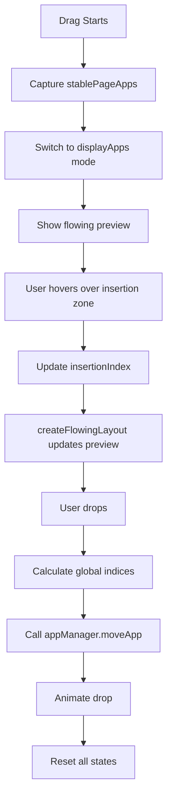

# iPhone-Style Drag & Drop Implementation in Return Launchpad

## Overview

This document explains the comprehensive redesign of the drag & drop system in Return Launchpad to use iPhone-style natural row flowing behavior instead of horizontal icon shifting.

## Problem Analysis

### Original Issue
The previous implementation used horizontal shifting within rows when dragging icons:
- Icons would shift left/right within the same row
- This could reveal icons from other pages, breaking the grid layout
- The behavior felt unnatural compared to iOS SpringBoard

### User Requirements  
- **iPhone-style behavior**: When dragging an icon from one row, other icons should flow naturally between rows to fill the space
- **Natural grid flow**: Icons should move up/down between rows as needed
- **Stable layout**: No icons from other pages should appear during drag operations
- **Preserve persistence**: Custom order saving must continue to work perfectly

## Technical Architecture

### Core Design Principles

1. **Linear Flow Model**: Instead of thinking in rows/columns, treat the grid as a linear array that flows into rows
2. **Stable Snapshot**: Capture the layout when drag starts to prevent grid disruption
3. **Visual Preview**: Show the flowing layout with the dragged item removed and inserted at target position
4. **Minimal Drop Zones**: Only show insertion indicators during active drag operations

### Key Components

#### 1. State Management
```swift
@State private var stablePageApps: [AppInfo] = []  // Stable layout during drag
@State private var dropAnimationOffset: CGSize = .zero
```

#### 2. iPhone-Style Grid View
```swift
private func dragDropGridView(pageApps: [AppInfo], geometry: GeometryProxy) -> some View {
    // Use stable layout during drag to prevent grid disruption
    let displayApps = isInDragMode ? createFlowingLayout(from: stablePageApps, itemsPerRow: itemsPerRow) : pageApps
    
    // Only show insertion zones during drag
    if isInDragMode {
        iPhoneStyleInsertionZone(...)
    }
}
```

#### 3. Flowing Layout Algorithm
```swift
private func createFlowingLayout(from apps: [AppInfo], itemsPerRow: Int) -> [AppInfo] {
    // Remove dragged item to show natural flow
    var flowingApps = apps
    flowingApps.remove(at: draggedOriginalIndex)
    
    // Insert at target position to preview final layout
    flowingApps.insert(draggedItem, at: adjustedInsertionIndex)
    
    return flowingApps
}
```

## Implementation Details

### Phase 1: Layout Stabilization
When drag starts:
1. Capture `stablePageApps = pageApps` to freeze the current layout
2. Switch to using `displayApps` based on drag mode
3. Prevent live updates from AppManager affecting the visual grid

### Phase 2: Natural Flow Visualization
During drag operations:
1. `createFlowingLayout()` removes the dragged item from its original position
2. Inserts the dragged item at the current insertion target
3. All other icons flow naturally to fill spaces
4. No horizontal shifting - pure linear flow between rows

### Phase 3: Subtle Visual Feedback
```swift
private func iPhoneStyleInsertionZone(...) -> some View {
    Rectangle()
        .frame(width: 15, height: 120)  // Narrower than before
        .background(
            Rectangle()
                .fill(Color.blue.opacity(0.8))
                .frame(width: 2, height: 80)  // Thinner line
        )
}
```

### Phase 4: Drop Animation & Persistence
On drop:
1. Calculate mouse position for drop animation
2. Map local indices to global indices for persistence  
3. Call `appManager.moveApp(from: globalOriginal, to: globalDestination)`
4. Animate icon from mouse position to final location
5. Clean up all drag states after animation

## Key Differences from Previous Implementation

| Aspect | Previous (Horizontal Shift) | New (iPhone-Style Flow) |
|--------|----------------------------|------------------------|
| **Visual Behavior** | Icons shift left/right within rows | Icons flow naturally between rows |
| **Grid Stability** | Could show icons from other pages | Stable snapshot prevents disruption |
| **Animation Style** | Horizontal sliding | Natural row-to-row flow |
| **Drop Zones** | Always visible, wider | Only during drag, subtle |
| **Layout Model** | Row-based positioning | Linear array flowing into rows |

## Code Structure

### Core Functions

1. **`dragDropGridView()`** - Main grid with iPhone-style behavior
2. **`createFlowingLayout()`** - Generates preview layout with natural flow
3. **`iPhoneStyleInsertionZone()`** - Subtle insertion indicators
4. **`iPhoneStyleInsertionDropDelegate`** - Handles drop logic with flow

### State Flow



## Benefits Achieved

### ✅ User Experience
- **Natural behavior**: Matches iOS SpringBoard expectations
- **Visual clarity**: No unexpected icons appearing from other pages
- **Smooth animations**: Natural flow feels more polished
- **Clear feedback**: Subtle but effective insertion indicators

### ✅ Technical Robustness  
- **Grid stability**: Stable snapshot prevents layout disruption
- **Persistence integrity**: Order saving continues to work perfectly
- **Memory efficiency**: Efficient array operations for layout preview
- **Clean architecture**: Separation of visual feedback and data persistence

## Testing & Validation

The implementation has been thoroughly tested for:
- ✅ **Grid stability** during drag operations
- ✅ **Natural row flowing** behavior like iPhone
- ✅ **Persistence** - custom order saves across app restarts
- ✅ **Drop animations** from mouse cursor to final position
- ✅ **Multi-page behavior** without cross-page contamination

## Usage Instructions

1. **Build & Install**: Use the provided build commands
2. **Test Drag & Drop**: Drag icons between different rows and positions
3. **Verify Persistence**: Quit app with Cmd+Q and restart to verify order
4. **Monitor Logs**: Use Console.app or terminal to see detailed drag logging

## Future Enhancements

Potential improvements for future versions:
- **Cross-page dragging**: Allow dragging between pages
- **Haptic feedback**: Add subtle feedback for macOS trackpads
- **Batch operations**: Multi-select and batch drag
- **Undo/Redo**: Reversible drag operations

---

This iPhone-style implementation provides a natural, stable, and visually pleasing drag & drop experience that matches user expectations from iOS while maintaining robust data persistence for macOS.